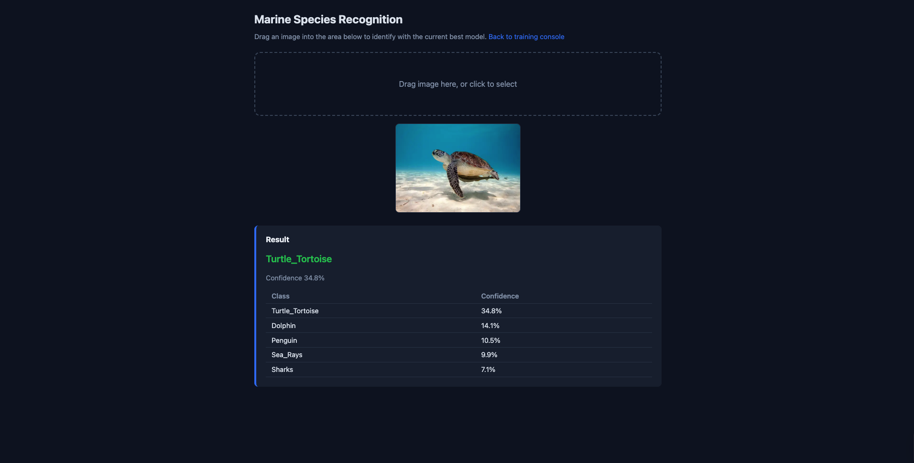

# Marine Species Classifier

## Description

**Marine Species Classifier** is a local, end-to-end image classification pipeline for marine life (fish, mammals, reptiles, etc.). It provides a **web dashboard** for managing per-class image data, training CNN/ResNet18/AlexNet models with configurable YAML settings, and a **drag-and-drop Identify page** that runs the current best checkpoint on any uploaded image and returns top-k predictions with confidence. All runs locally—no cloud required.

*Local image classifier for marine species with a web UI for data, training, and drag-and-drop identification (PyTorch, Flask).*


---

## Features

- **Web dashboard** (Flask) at `http://127.0.0.1:5001`:
  - View dataset stats and train/val/test splits
  - Add new classes and upload images (drag-and-drop)
  - Update splits (70/15/15), start or continue training
  - Live training progress: loss/accuracy curves and status (Training / Idle)
- **Identify page** at `http://127.0.0.1:5001/predict`:
  - Drag an image to get top‑k predictions and confidence from the current best checkpoint
- **Multiple backbones**: small CNN (default), **ResNet18**, **AlexNet** (Hinton et al.)
- **Training**: YAML configs, early stopping, cosine LR, optional TensorBoard
- **Evaluation**: test-set metrics and confusion matrix

---

## Screenshots

| Training console | Identify (drag-and-drop) |
|------------------|---------------------------|
|  |  |

---

## Project structure

```
marine_animal/
├── configs/
│   ├── cnn.yaml          # Small CNN (default)
│   ├── resnet18.yaml     # ResNet18 pretrained
│   └── alexnet.yaml      # AlexNet (Hinton et al.)
├── dashboard_static/
│   ├── index.html        # Training console
│   └── predict.html      # Identify page
├── data/
│   ├── processed/        # Per-class image folders
│   └── splits/           # train.txt, val.txt, test.txt
├── docs/
│   ├── images/           # Screenshots for README
│   └── TRAINING_STRATEGY.md
├── scripts/
│   └── start_dashboard.sh
├── src/
│   ├── serve_dashboard.py  # Flask app (dashboard + /api/predict)
│   ├── inference.py        # Load model, run prediction
│   ├── train.py
│   ├── evaluate.py
│   ├── predict.py         # CLI prediction
│   ├── dataset.py
│   ├── models/            # cnn, resnet18, alexnet
│   └── utils/
├── checkpoints/          # best.pt (best validation loss)
├── reports/               # training_log.json, results.json, figures/
├── runs/                  # TensorBoard logs
├── requirements.txt
└── README.md
```

---

## Installation

```bash
git clone https://github.com/ChuanBuJianRi/Marine-Animal-Classification.git
cd marine_animal
pip install -r requirements.txt
```

**Requirements:** Python 3.9+, PyTorch 2.0+, torchvision, Flask, Pillow, PyYAML, and others (see `requirements.txt`).

---

## Quick start

### 1. Prepare data
Download dataset from kaggle: https://www.kaggle.com/datasets/vencerlanz09/sea-animals-image-dataste
Thank you for the amazing dataset!

Put images in **per-class folders** under `data/processed/`:

```
data/processed/
├── Dolphin/
│   ├── img1.jpg
│   └── ...
├── Shark/
│   └── ...
└── Turtle_Tortoise/
    └── ...
```

Or use the dashboard: add classes and drag-and-drop images, then click **Update splits**.

### 2. Train

From the project root:

```bash
# Default: small CNN
python3 -m src.train --config configs/cnn.yaml

# Better accuracy: ResNet18 or AlexNet
python3 -m src.train --config configs/: https://www.kaggle.com/datasets/vencerlanz09/sea-animals-image-dataste
python3 -m src.train --config configs/alexnet.yaml
```

Training writes to `reports/training_log.json` and saves the best model to `checkpoints/best.pt`. The dashboard reads the log and shows curves; it also uses `best.pt` for the Identify page.

### 3. Run the dashboard

```bash
python3 -m src.serve_dashboard
```

Then open:

- **Console:** http://127.0.0.1:5001  
- **Identify:** http://127.0.0.1:5001/predict  

On macOS, port 5001 is used by default (5000 is often taken by AirPlay). To restart with a clean port:

```bash
./scripts/start_dashboard.sh
```

### 4. Identify an image (web or CLI)

- **Web:** Open http://127.0.0.1:5001/predict and drag an image.
- **CLI:**
  ```bash
  python3 -m src.predict --ckpt checkpoints/best.pt --image path/to/image.jpg
  ```

### 5. Evaluate on test set

```bash
python3 -m src.evaluate --ckpt checkpoints/best.pt --split test
```

Outputs: `reports/results.json` and `reports/figures/confusion_matrix.png`.

---

## Configuration

Edit `configs/*.yaml` to change:

- **Model:** `model.name` (`cnn`, `resnet18`, `alexnet`), `dropout`, `pretrained`
- **Data:** `image_size` (224), `train_batch_size`, `val_batch_size`
- **Training:** `epochs`, `lr`, `scheduler`, `early_stop_patience`

See [docs/TRAINING_STRATEGY.md](docs/TRAINING_STRATEGY.md) for tips on higher accuracy.

---

## API (for the dashboard)

| Endpoint | Method | Description |
|----------|--------|-------------|
| `/` | GET | Training console (index.html) |
| `/predict` | GET | Identify page (predict.html) |
| `/api/dataset_stats` | GET | Dataset and split stats |
| `/api/training_log` | GET | Training history (for curves) |
| `/api/training_status` | GET | `{ "running": true/false }` |
| `/api/classes` | GET/POST | List or create classes |
| `/api/upload` | POST | Upload images (form: class_name, files) |
| `/api/update_splits` | POST | Regenerate train/val/test splits |
| `/api/start_training` | POST | Start training (config: cnn.yaml) |
| `/api/predict` | POST | Predict from one image (form: image, optional top_k) |

---

## License

MIT.
